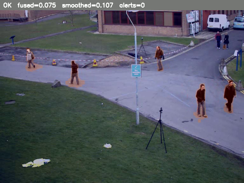
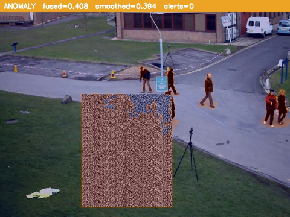

<h1 align="center">edge-anomaly-detection</h1>

<p align="center">
  <i>Real-time anomaly detection on video streams. Motion + scene-change + PaDiM feature-distribution detectors, fused under ROI and severity gating. C++ on TensorRT / DeepStream for the edge.</i>
</p>

<p align="center">
  
  
  
  
  
</p>

---

## Demo

<p align="center">
  
</p>

Above is the actual output of the C++ `eanom_video` binary, frame for
frame. The clip is the classic OpenCV `vtest.avi` pedestrian sample;
to exercise the alerting path, a moving high-texture object is
composited into the walkway partway through (a stand-in for an
intrusion / visual interference event).

The pipeline stays quiet during normal pedestrian traffic and raises
a single `walkway` zone warning the moment the object enters the
monitored region, then settles back to **OK** once it leaves — motion
detection → score fusion → temporal smoothing → ROI scoring →
severity-laddered alert, all in one pass.

<p align="center">
  
  &nbsp;&nbsp;
  
</p>
<p align="center"><sub>Left: normal traffic (OK, low score). Right: object in the walkway (ANOMALY, red banner).</sub></p>

Reproduce it with nothing but a compiled binary and the public sample
clip — no model, no GPU required for this configuration:

```bash
# the pedestrian sample used above
curl -L -o vtest.avi https://github.com/opencv/opencv/raw/4.x/samples/data/vtest.avi
./build/eanom_video --config configs/demo_pedestrian.yaml \
    --input vtest.avi --output annotated.mp4
```

> The animation was rendered inside the project's own Docker image
> (`nvcr.io/nvidia/deepstream:8.0-gc-triton-devel` base) running the
> compiled `eanom_video`; `ffmpeg` only decoded the input and encoded
> the GIF.

---

## Why this exists

Anomaly detection on industrial / perimeter video has three
recurring failure modes:

- **Single-signal detectors miss things.** Background subtraction
  alone has no opinion about a slow lighting change. A scene-hash
  detector alone has no opinion about a moving forklift in an
  otherwise still frame. An ML detector trained on "normal" video
  alone is blind to a camera that someone bumped out of alignment.
- **Flicker pollutes the alert queue.** A bird crossing the frame
  scores high on every detector for two frames. Without temporal
  smoothing and a minimum-duration filter, every operator dashboard
  fills up with garbage in an afternoon.
- **No site is uniform.** "Movement in the warehouse" is a problem
  at 2am and normal at 9am; movement in the loading zone is normal
  at any time. Per-zone severity multipliers and ignore masks are
  not a luxury - they are why a real deployment works.

This repository is a clean-room reference implementation that
addresses all three. Algorithms are public (MOG2 background
subtraction, DCT perceptual hash, Defard et al. PaDiM); the code is
original and uses only public model checkpoints + synthetic test
streams.

## What's inside

- **Three orthogonal detectors** behind a common `DetectionResult`
  contract:
    - `MotionDetector` (OpenCV MOG2/KNN + morphology + contour area)
    - `SceneChangeDetector` (HSV histogram + pHash + edge-density)
    - `PaDiMDetector` (per-position Mahalanobis distance on
      pretrained ResNet18 features via TRT)
- **Score fusion** (`weighted_sum` or `max`) over the per-detector
  outputs, normalised with a saturating squash so wildly different
  score scales play together
- **Temporal smoother** (EMA + minimum-duration debouncer) to kill
  transient flicker
- **ROI manager** with polygonal zones, per-zone severity
  multipliers, and "ignore" masks
- **Alert generator** with severity laddering and per-zone cooldown;
  pluggable sinks (stdout, file, webhook stub)
- **Python training scaffold** that exports ResNet18 features to
  ONNX and fits the PaDiM Gaussian statistics over a "normal" image
  folder
- **Docker** (DeepStream-devel base) for reproducible builds

## Architecture

```
              ┌────────────────────────────────────────────────┐
   frame ──►  │ Motion ─┐                                     │
              │ Scene  ─┼──►  Fusion  ──► Temporal  ──► Firing │
              │ PaDiM  ─┘     (weight    Smoother    (min     │
              │ (optional)    or max)    (EMA)       duration)│
              └─────────────────────┬─────────────────────────┘
                                    │
                              fused heatmap
                                    │
                          ┌─────────▼─────────┐
                          │   ROI Manager     │
                          │  per-zone scores  │
                          └─────────┬─────────┘
                                    │
                          ┌─────────▼─────────┐
                          │  Alert Generator  │
                          │  severity ladder  │
                          │  + cooldown       │
                          └─────────┬─────────┘
                                    │
                          stdout / file / webhook sinks
```

## Quick start

```bash
cmake -S . -B build -G Ninja -DCMAKE_BUILD_TYPE=Release
cmake --build build -j

# 1. (Optional) Train PaDiM stats on your "normal" data.
cd training && pip install -e . && cd ..
python -m eanom_train.export_backbone --output models/onnx/resnet18_features.onnx
./scripts/build_engines.sh
python -m eanom_train.fit_padim \
    --image-dir data/normal \
    --output models/stats/padim_industrial.bin

# 2. Configure detectors / ROI in configs/system_config.yaml.

# 3. Run on a video.
./scripts/infer_video.sh input.mp4 annotated.mp4
```

Or via Docker:

```bash
docker compose up --build
```

## Configuration knobs

`configs/system_config.yaml` is the single source of truth. Three
sections are worth tuning per site:

- **`detectors`**: each detector has its own enable flag and
  hyperparameters. Start with motion + scene_change only; add
  PaDiM once you have 200-500 normal images to fit it.
- **`ensemble.weights`**: which detector should the fused score
  lean on. Default `motion: 0.3, scene_change: 0.2, padim: 0.5`
  works for an indoor industrial scene; outdoor perimeter sites
  usually want motion bumped to 0.5+.
- **`roi.zones`**: rectangles or polygons. Use `ignore: true` for
  zones you never want to alert on (a road, an HVAC vent, the
  camera's date overlay). Use `severity_multiplier` to escalate
  high-value zones.

## Project structure

```
.
├── CMakeLists.txt
├── cmake/
├── configs/system_config.yaml
├── docker/, docker-compose.yml
├── include/eanom/
│   ├── config/        SystemConfig + YAML loader
│   ├── detectors/     motion, scene_change, padim + DetectionResult
│   ├── ensemble/      score_fusion, temporal_smoother
│   ├── roi/           polygonal zone manager
│   ├── events/        alert_generator + pluggable sinks
│   ├── trt/           TRT engine wrapper (PaDiM backbone)
│   ├── pipeline/      AnomalyPipeline
│   ├── overlay/       heatmap + banner renderer
│   └── utils/
├── src/                       (mirrors include/)
├── tools/                     benchmark.cpp
├── training/                  Python: fit_padim.py, export_backbone.py
├── scripts/                   build_engines.sh, infer_video.sh
└── docs/                      architecture, deployment notes
```

## Performance

Indicative numbers on synthetic 720p input, RTX 3090, motion +
scene_change enabled (PaDiM off):

| Configuration                | p50 latency |
|------------------------------|------------:|
| Motion only (MOG2)           | ~3 ms       |
| Motion + scene_change        | ~6 ms       |
| Motion + scene_change + PaDiM (ResNet18 FP16) | ~14 ms |

Jetson Orin Nano (8 GB) hits roughly 3x these latencies under FP16.

## Limitations

- The PaDiM backbone here is ResNet18 with random channel subset to
  100; you can swap for ResNet50 + 550 channels by changing
  `feature_dim` in the YAML and re-running the fit script, but the
  stats file grows quadratically with `feature_dim` so be conscious
  of edge storage.
- The webhook sink is a stub: it logs the payload but does not
  actually POST. Wire libcurl in if you need real delivery.
- The DeepStream pipeline scaffolding is present but the offline
  driver in `main.cpp` is OpenCV-based; production deployments
  should adapt the GStreamer path for live RTSP.
- Severity classification thresholds (`> 0.7 -> warning`,
  `> 1.5 -> critical`) are baked into the generator for the
  reference build; lift them into the YAML for production.

## Roadmap

- [ ] DeepStream pipeline that exposes the same per-frame contract
- [ ] PatchCore as an alternative ML detector (better than PaDiM at
      the cost of higher memory)
- [ ] Camera-bump detector (long-window pHash deviation) as a
      separate signal so it does not pollute the per-frame ensemble
- [ ] libcurl-backed webhook sink with retry + signing

## License

MIT - see [LICENSE](LICENSE).

## About

This repository is a reference implementation of patterns from
production industrial / perimeter video analytics. Algorithms are
the published originals; the code is written from scratch.

Open to contract work on similar systems -
[email](mailto:khusanabdirayimov@gmail.com) -
[GitHub](https://github.com/Abdirayimov)
